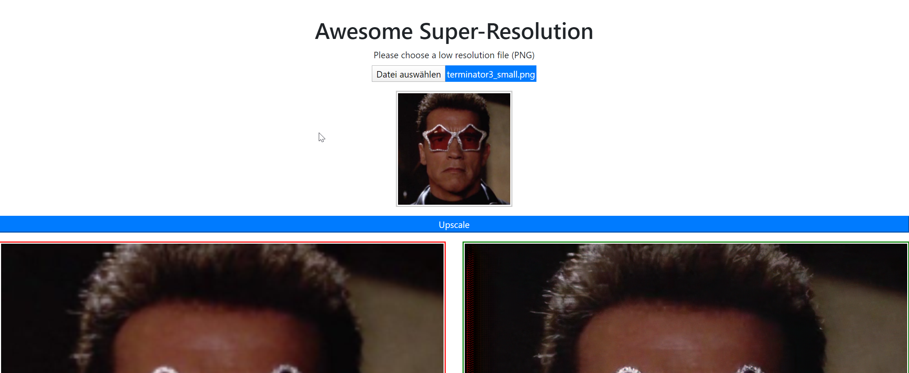

```{r setup, include=FALSE}
library(knitr)
knitr::opts_chunk$set(echo = TRUE)
```

# Applied Deep Learning

## Initiate

The initial idea for a project in Applied Deep Learning (ADL) was to train a generative adversarial network (GAN) to upscale low resolution images to high resolution images. Based on the approach in [@DBLP:journals/corr/abs-1804-02900] the goal was to improve the results from the paper and deliver the trained network to upscale low resolution images in the browser. The field of research is called Super-Resolution (SR) and allows upscaling up to factor 4 (the networks I inspected). The background was to save network bandwidth while transfering high resolution images.

The dataset is available, the code is commited on Github\footnote{\url{https://github.com/fperazzi/proSR}, seen on 2020-01-22}.


## Hacking

In the first step I transfered the code to Google Colab\footnote{\url{https://colab.research.google.com/drive/1oPgjW7k23esFMHMgTT_eK5b4xy129AR9}, seen on 2020-01-22} and tried to train the network.

Colab crashed every now and then so I switched to a GPU based Azure VM. Long story short, I was not able to get the GPU support running on Azure and continued training with CPU which was very slow - first 1000 epochs of suggested 5000 ran roughly 5 hours. I terminated training after 1200 epochs (see learning progress in figure \ref{epochs_low}, \ref{epochs_medium}, \ref{epochs_high}) and wanted to use the intermediate model to transform it for Tensorflow.js\footnote{\url{https://www.tensorflow.org/js}, seen on 2020-01-22}. The transformation was not possible and I could not use it to implement the upscaling application.

Nevertheless, I downloaded an existing SR network but could not use it because I was not able to find out in which format the input was required.


## Deliver

Finally, after some research I found another SR network based on [@DBLP:journals/corr/LedigTHCATTWS16] with a Github repository\footnote{\url{https://github.com/krasserm/super-resolution}, seen on 2020-01-22} which is implemented in Tensorflow 2\footnote{\url{https://www.tensorflow.org/}, seen on 2020-01-22}. The codebase provides some Jupyter notebooks to train and test the weights and also contains links to weights for immediate usage.

On top of this I implemented a simple, client/server web application (based on FLASK\footnote{\url{https://www.palletsprojects.com/p/flask/}, seen on 2020-01-22} see screenshot \ref{screenshot}) which allows the upload of a low resolution PNG image which gets upscaled by using a  SR-GAN and a simple bilinear upscaling as benchmark. Both images are displayed next to another for comparion. 

The web application sends the low resolution image to the backend which does the upscaling. The decision to upscale on the backend was driven by the fact, that the model can easier be used in the same environment as it was trained: Python + Tensorflow 2. For the frontend implementation, simple HTML and JS were used.

Nevertheless the application looses its desired advantage to handle everything in the frontend.



The source code an a more detailed description is available on Github\footnote{\url{https://github.com/websta/AppliedDeeplearning}, seen on 2020-01-22} and contains a dockerfile to pack everything together which is required to run the Super-Awesome Super-Resolution.


## Take-aways

My main take-aways are:

- Neural networks are not that scary, as it seems, I am still wondering how someone can come up with the network structure. Probaly I need to see more networks to get an idea.

- Setting up GPU based learning is not that easy, even you have a tutorial.

- Using the network needs information about the format of the required input. Could not find that for existing models on ModelZoo\footnote{\url{https://modelzoo.co/}, seen on 2020-01-22}.

- Probably the simples use of a neural network is to put it into the same environment as it was trained (Python and Tensorflow 2 in my case) and attach some REST endoints.


# Effort

For the 3 phases of the project, these are my time spent (roughly):

- Initiate: 3 hours research, report
- Hacking: 40 hours translating code to Colab, Google Drive integration, rerun training on Colab, provisioning and installing Cuda on Azure VM, training on CPU, collecting and interpret results, tries to convert model to tensorflow.js, tries to use another model, report
- Delivery: 20 hours creating a web application (client/server), testing & minimal style, dockerfile, report


# References